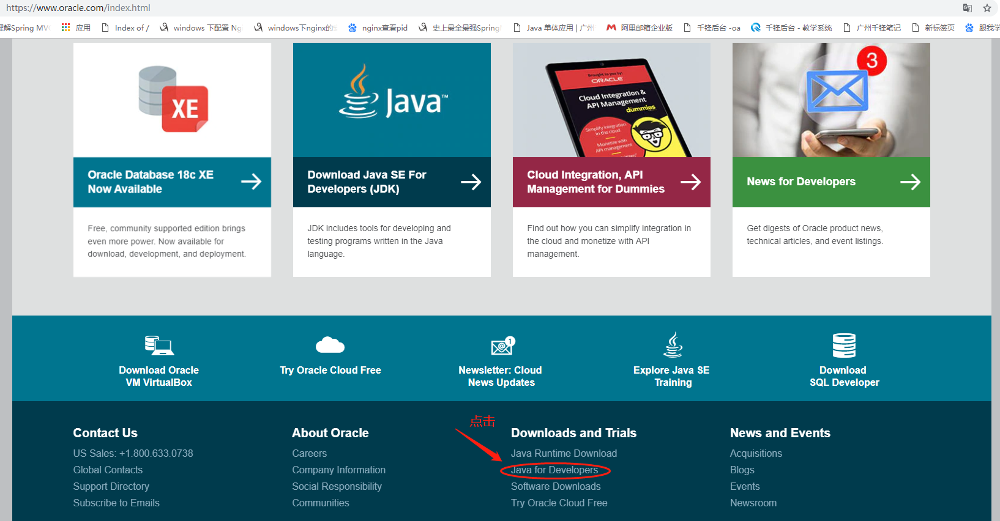
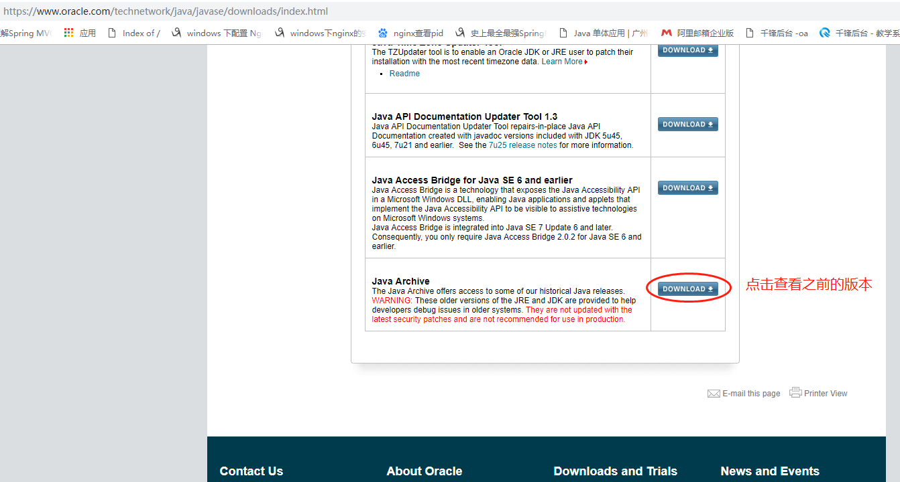
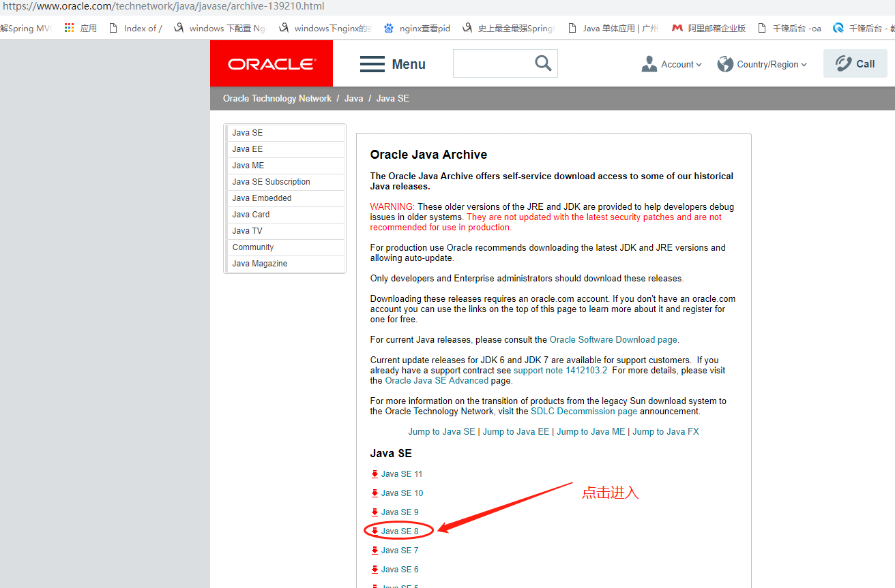
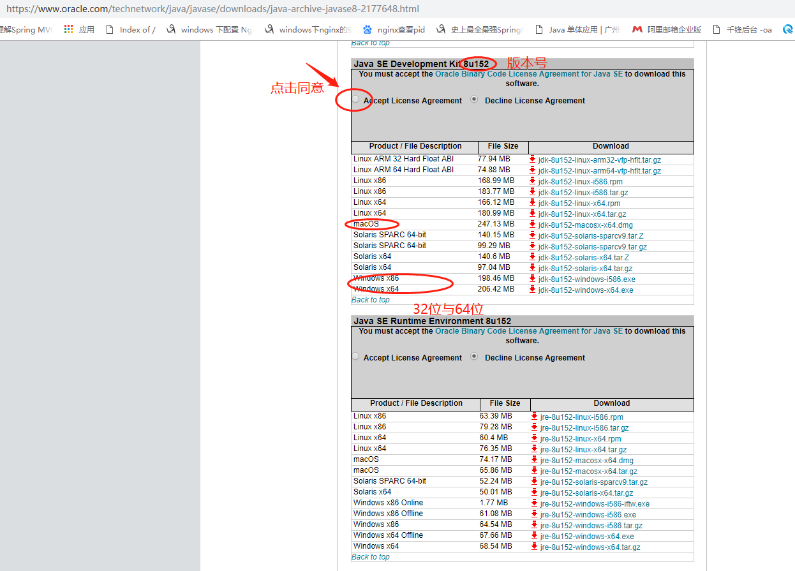
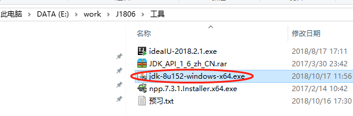
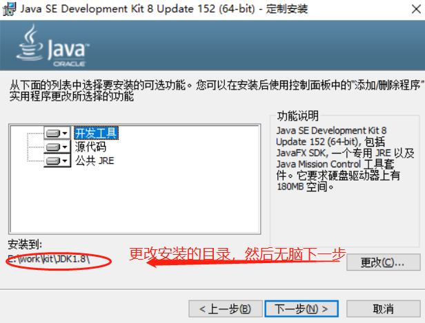
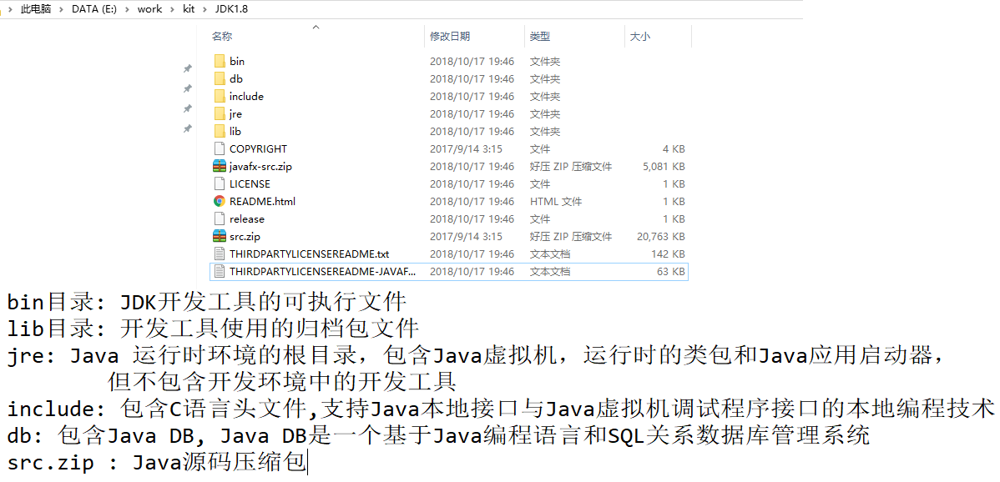
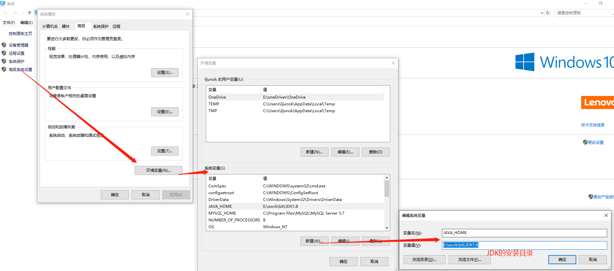
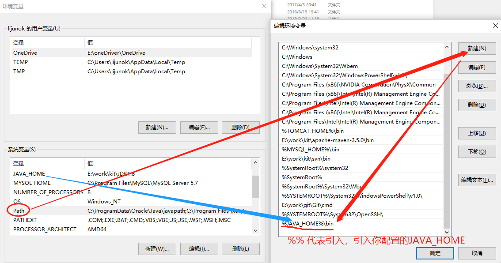
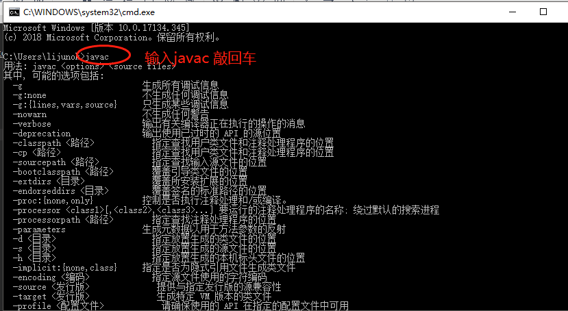

# JDK下载与安装

## 一、JDK下载步骤

- Java已经被Oracle收购，进入Oracle官网下载













## 二、安装之后目录




## 三、配置环境变量






```
我的电脑 --> 页面空白处，鼠标右键 --> 属性
--> 左侧边栏 高级系统设置 --> 环境变量


新建：
变量名:JAVA_HOME
变量值:D:\Program Files\Java\jdk1.8.0_211
		就是jdk的安装目录

新建:
变量名:CLASSPATH
变量值:.;%JAVA_HOME%\lib;%JAVA_HOME%\lib\tools.jar

修改:
变量名:path
添加内容:
	;%JAVA_HOME%\bin;%JAVA_HOME%\jre\bin;
```


## 四、测试是否安装成功

打开终端：

方法一：开始|Windows系统|命令提示符

方法二：搜索框里直接搜索：命令提示符或者cmd

方法三：快捷键：win+R键，然后输入cmd





