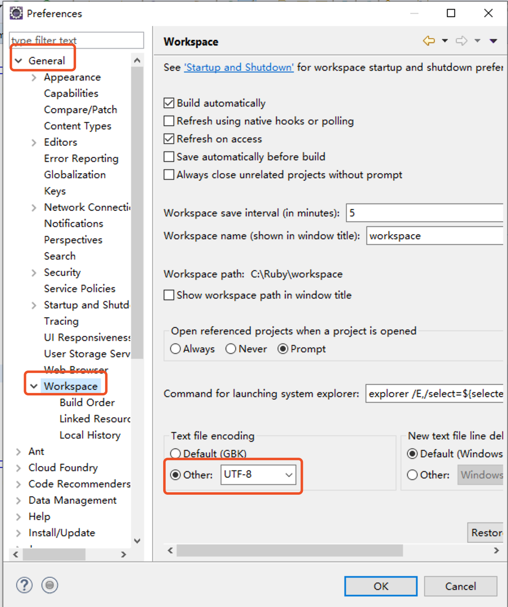

# Java开发工具的安装和使用

java的执行流程：

step1：编写java的源代码

step2：将源代码进行编译：javac

​	生成一个字节码文件：二进制文件：.class文件

step3：解释执行字节码文件

## 一、Java开发工具的介绍

1、文本编辑器：

​	记事本、Editplus、nodepad++。。

2、集成开发工具：

​	eclipse：免安装

​	IntelliJ IDEA

​	。。。

## 二、eclipse的使用

### 1、获取eclipse工具

可以直接下载百度网盘链接中的工具：https://pan.baidu.com/s/1Kqg-O0r7H7KpXAXT3xvXww 密码:dqh4

也可以到eclipse的官网上下载：https://www.eclipse.org/>

### 2、工具进行解压缩

### 3、启动eclipse

设置workspace工作空间：

设置字体颜色

### 4、常规设置

点开Window下面的preferences

- 设置字体大小：window-preferences后：general-appearance-colors and fonts

  

- 设置自动提示：window-preferences后：Java-editor-content assist

  将a-z，A-Z之间的所有字母都添加进去

  

- 设置编码格式：window-preferences后：General-->WorkSpace，或者搜索workspace，选择编码格式，默认为GBK，不过选择UTF-8为好。

  

- 如果还想设置其他，请自行百度。。。

### 5、常用快捷键

Ctrl+1 快速修复(最经典的快捷键,就不用多说了)
Ctrl+D  删除当前行 
Ctrl+Alt+↓ 复制当前行到下一行(复制增加)
Ctrl+Alt+↑ 复制当前行到上一行(复制增加)
Alt+↓ 当前行和下面一行交互位置(特别实用,可以省去先剪切,再粘贴了)
Alt+↑ 当前行和上面一行交互位置(同上)
Ctrl+/ 注释当前行,再按则取消注释
Shift+Enter 在当前行的下一行插入空行(这时鼠标可以在当前行的任一位置,不一定是最后)
Ctrl+Shift+F 格式化当前代码
全局 放大 Ctrl+= 
全局 缩小 Ctrl+- 
。。。。

