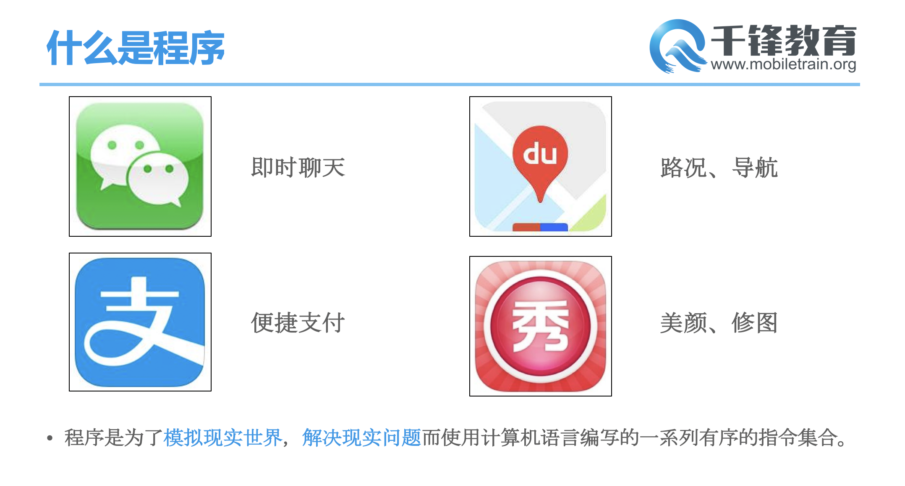
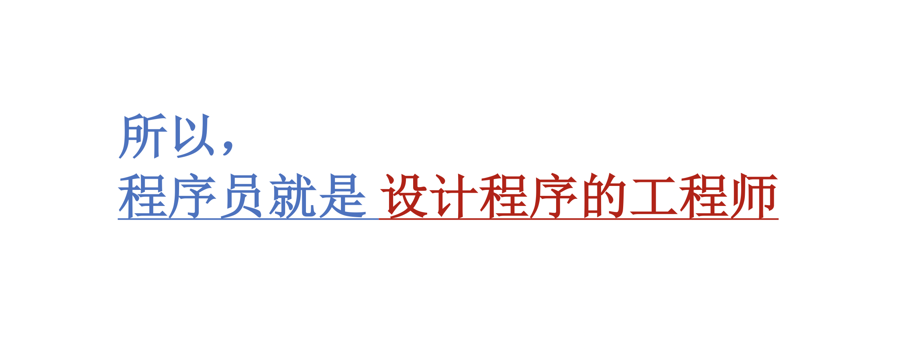
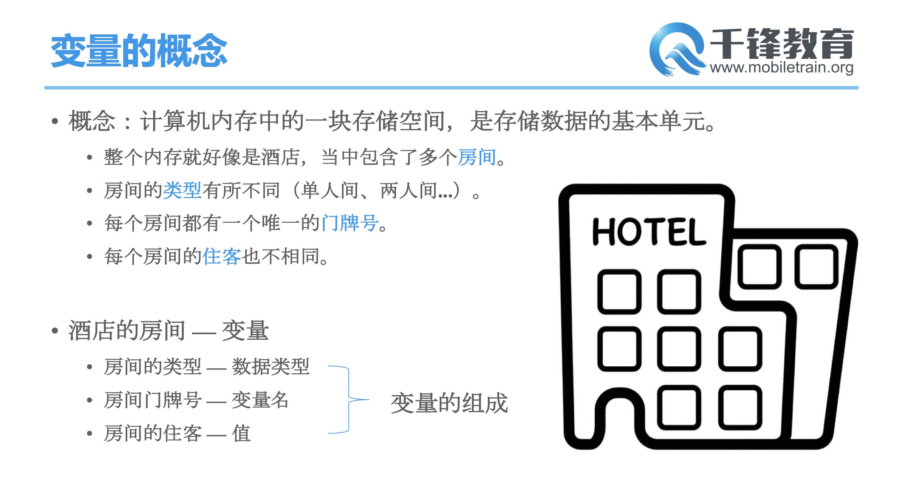
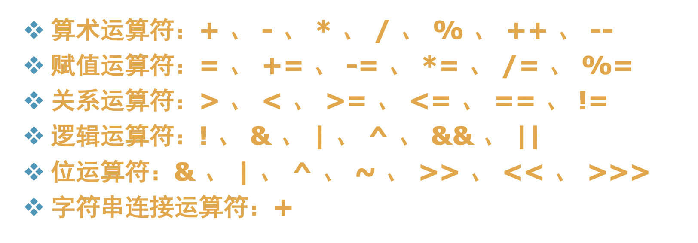
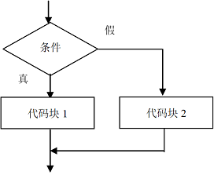
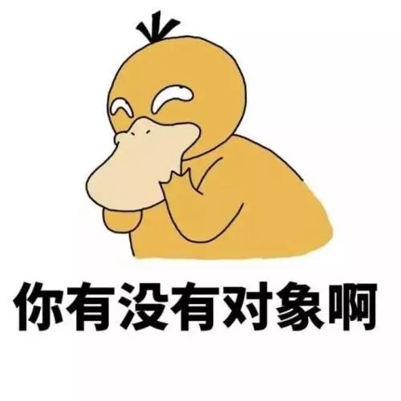
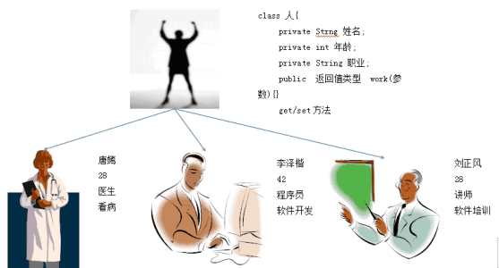

# Java面向对象编程思想

## 一、什么是程序







## 二、基本语法

### 1、变量




**变量的声明和初始化**

```
变量的声明格式：
 1. 先声明，再赋值(初始化)
 	数据类型  变量名； 
 	变量名 = 变量值；
 	举例：int i; 
 		 i=100;
 2. 声明同时赋值
 	数据类型  变量名 = 变量值；
 		int j=20;
```

##### 

### 2、数据类型

Java中的数据类型一共分为两大类：基本类型(也叫简单类型)和引用类型。

基本类型：4类8种。

引用类型：类，数组，接口，集合。。。


### 3、运算符




### 4、分支语句

```
程序有三种流程结构：
A：顺序结构(默认)
	程序默认从上向下一行一行执行。
B：选择结构
	条件满足，某些代码才会被执行。
C：循环结构
	条件满足，某些代码会反复多次执行，直到条件不满足。
```


**选择结构：通过分支语句实现。**

- if语句
- switch-case语句




### 5、方法的使用

**方法的概念**

Java的方法类似于其它语言的函数，是一段用来完成特定功能的代码片段，声明格式：

作用：

A：提高了程序的可读性，减少了冗余

B：增强了程序的扩展性


使用：

step1：定义方法

step2：使用方法：进行方法的调用

**一个方法可以被多次调用执行，被调用几次，就执行几次。**

```java
[修饰符1 修饰符2 …] 返回值类型 方法名(形式参数列表){
  程序代码;
  return 返回值;
}

```


## 二、什么是面向对象

### 1、面向对象



```
面向对象：(OOP)
	不是一种语言，而是一种编程思想。
	面向对象程序设计：(Object Oriented Programming)
		Object：对象
		Oriented：方向，定向
		Programming：程序

生活中的面向对象：洗衣服，吃饭
面向过程：关注点是过程 ————站在一个执行者的角度去考虑事情，做事情
	//step1.找个盆
	//step2.收集要洗的衣服
	//step3.放水，放洗衣粉。。
	//step4：洗一洗
	//step5：晒一晒

面向对象：关注点是对象 ————站在指挥者的角度
	//step1：找个对象
	//step2：让他洗衣服
	
生活中的面向过程：亲力亲为，按照流程步骤来，一步一步，吭哧吭哧。。。
生活中的面向对象：找合适的人，做合适的事儿。。


面向过程：
	关注点在过程上(步骤)
	step1，step2，step3.。。。。
	总和分析，按照步骤实现即可。

面向对象：
	关注点在对象上
		万事万物皆对象。
	A：分析当前的问题域中所涉及的对象。
	B：这些对象有什么样的特征和功能。
		外部特征：静态属性
		动作行为：动态属性
	C：对象和对象之间的关系。
		继承关系，聚合关系，关联关系。。。
		
		类的堆砌。
```


### 2、类和对象

| 类           | 对象                                                         |
| ------------ | ------------------------------------------------------------ |
| 人类Person   | 钟南山院士，你，我，王二狗，李小花，袁隆平爷爷，马云爸爸。。 |
| 狗类         | 幻影，忠犬八公，二哈，啸天                                   |
| 猫类         | 嘟嘟，卡卡，你家的猫，姥姥家的白猫                           |
| 汽车类       | 我的黑色的长城车，58台红旗车，撞我的那台车。。               |
| 笔记本电脑类 | 我现在用的这个电脑15寸的pro，王二狗的华硕，你媳妇的联想      |
| 手机类       | 我的华为Mate30，你的小米mix2s，你媳妇用诺基亚n95             |

```
类：其实指的就是类别。对同一类事物的统称。对这类事物进行描述，--->创建class
	就是一个抽象的概念。
对象：
	类中的一个具体的实例，客观存在的，能用。个体。
```

如何定义一个类？

- 要有能够描述这一类别的外部特征——我们叫做属性(静态属性)

  变量就可以。(名词)

- 要有能够描述这一类别的行为功能——我们叫做方法(动态属性)

  方法就可以。(动词)


####

### 


总结：

1、开营典礼

2、项目介绍

3、环境搭建

4、Java入门

​	变量，数据类型，运算符


作业：

1、平台上的考试：选择题，简答题(代码题)

2、自我 介绍

3、预习：

分支语句，方法，面向对象，类和对象，数组，io，异常，网络数据下载，swing组件。。

