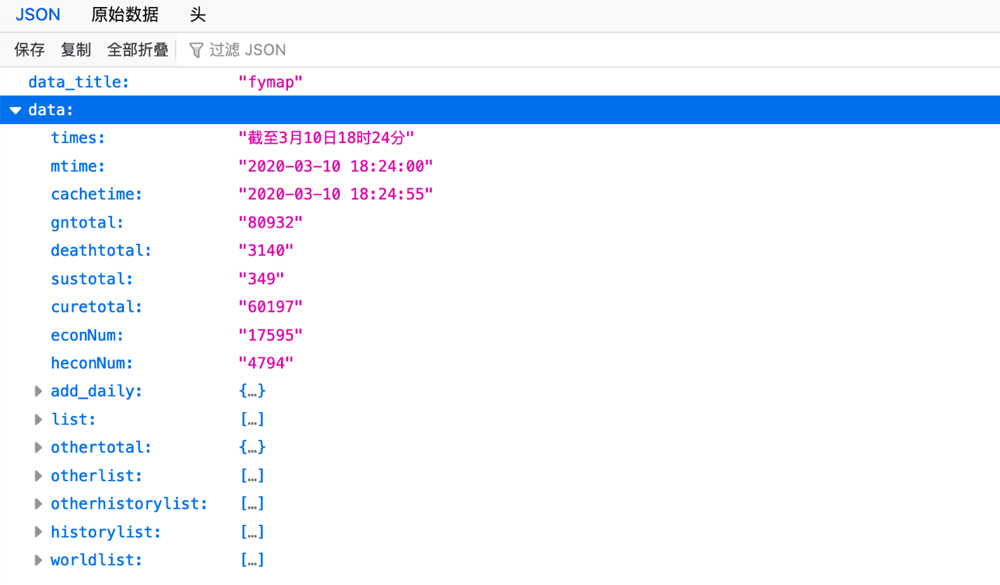
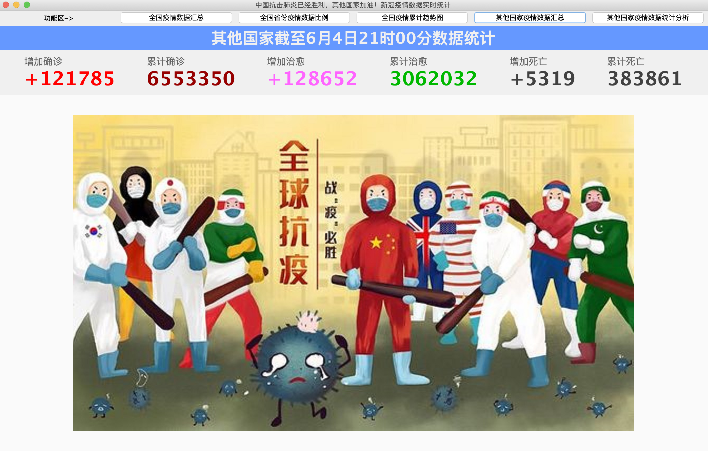
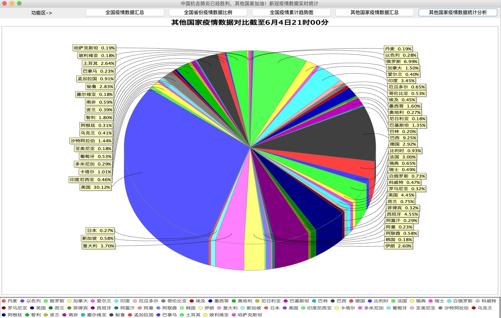

# 网络请求&数据抓取

## 一、必备知识

1、OOP：面向对象

类，对象

属性，方法

面向对象三大特征：封装，继承，多态。

​	继承性：描述两个类的关系，子类，父类。

2、循环

3、数组

4、异常处理

5、IO操作

6、网络请求

7、swing组件

​	JFrame类：窗口

​	默认的布局：边界布局：

​		上：北，north

​		下：南，south

​		左：西，west

​		右：东，east

​		中间，center

## 二、网络请求

如何从网络上下载一张图片？

## 三、数据抓取

新浪疫情数据接口：

https://interface.sina.cn/news/wap/fymap2020_data.d.json?_=1580892522427

### 1、爬取网络疫情数据

明晚预告：

疫情数据展示：我们将会使用到第三方组件快速构建以下视图，Java的优势在于无穷无尽的开源库等你来用

