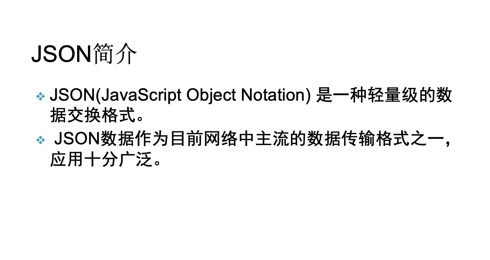
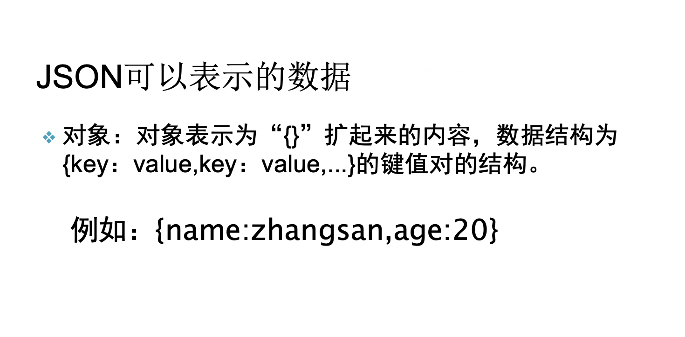
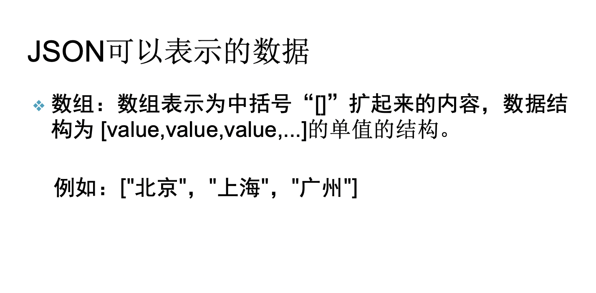

# json解析

### 一、必备知识

1、OOP面向对象

2、List集合

3、gson

### 二、什么是json

JSON(JavaScript Object Notation)




### 三、json格式

**json格式：就是一组无序的名值对组合。**

JSON基于两种结构：

1、对象：对象在js中表示为“{}”括起来的内容，数据结构为 {name：value,name：value,...}的键值对的结构，在面向对象的语言中，name为对象的属性，value为对应的属性值，所以很容易理解，取值方法为 对象.key 获取属性值，这个属性值的类型可以是 数字、字符串、数组、对象几种。




2、数组：数组在js中是中括号“[]”括起来的内容，数据结构为 ["java","javascript","c",...]，取值方式和所有语言中一样，使用索引获取，字段值的类型可以是 数字、字符串、数组、对象几种。



例如：

```json
{
     "id": 912345678901,
     "text": "How do I read a JSON stream in Java?",
     "geo": null,
     "user": {
       "name": "json_newb",
       "followers_count": 41
      }
   }

```


### 四、json解析

JSON解析的几种解析方式：

- JSON
- GSON
- FASTJSON


GSON解析的原理：

可以通过流来创建JsonReader对象

解析json对象：{}

- beginObject()
- endObject()

解析json数组：[]

- beginArray()
- endArray()


