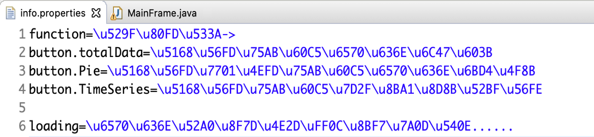
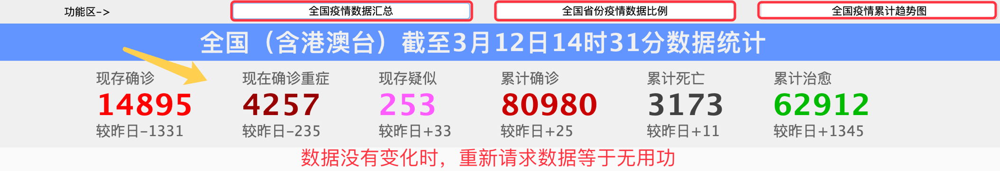
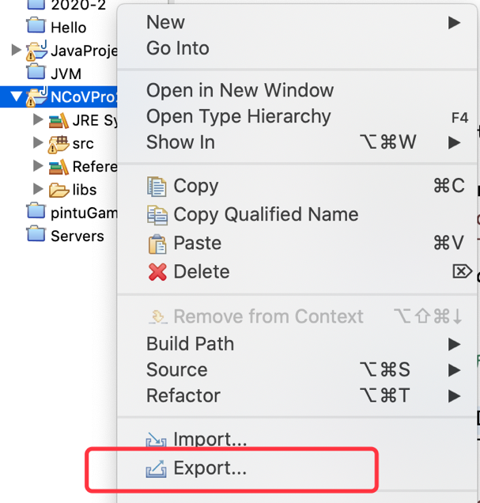
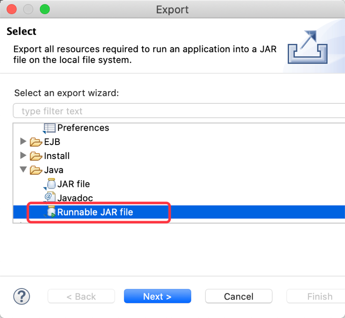
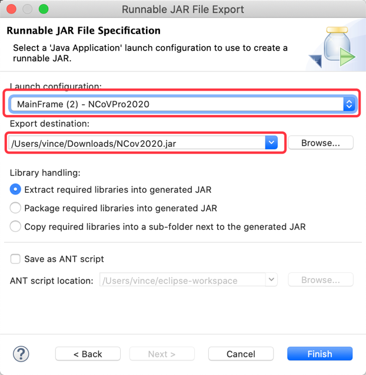

# 项目代码优化&总结

## 一、项目代码优化

### 1、文本信息内容优化

代码中的文本信息在真实项目开发中，应该如何处理？

properties 文件，称为属性文件，我们可以利用这个文本格式，存放一些文本信息，这样的好处是便于修改文本，而不需要改动代码！

> json格式：name:value,name:value.....
>
> properties:键值对
>
> 名1=值1
>
> 名2=值2
>
> 名3=值3
>
> 。。。

项目可维护性在开发中是非常重要的环节，要不然如何与产品经理相处？

### 2、网络请求数据优化

问题：网络请求会带来比较大的资源开销，频繁的请求肯定会影响项目的性能

那我们应该如何优化？

思路（避免频繁请求数据）：

1、把第一次请求后的数据缓存起来

2、第二次请求数据时，检查时间间隔，如果在间隔内，则使用原数据，如果在间隔外，请求网络数据

3、完工，打个包带走吧

打包后的样子：

打包步骤：

## 二、项目总结

本项目中我们学到了：

1、Java Swing 窗体的开发

​		 （1）组件：JButton、JLabel、JPanel、ImageIcon

​		 （2）布局：BorderLayout、FlowLayout、GridLayout

​		 （3）单点事件处理：ActionListener

​		 （4）窗体的基本属性设置：窗体大小、定位、关闭事件

2、网络编程

​		 （1）URL 实现网络请求

​		 （2）IO 流操作

3、JSON 数据解析

​		 （1）GSON 包中 JsonReader的使用

4、线程的使用：Thread

5、第三库如何使用

6、Properties属性文件的使用

7、JDK1.8中时间 API 的使用

8、项目打包（jar）

