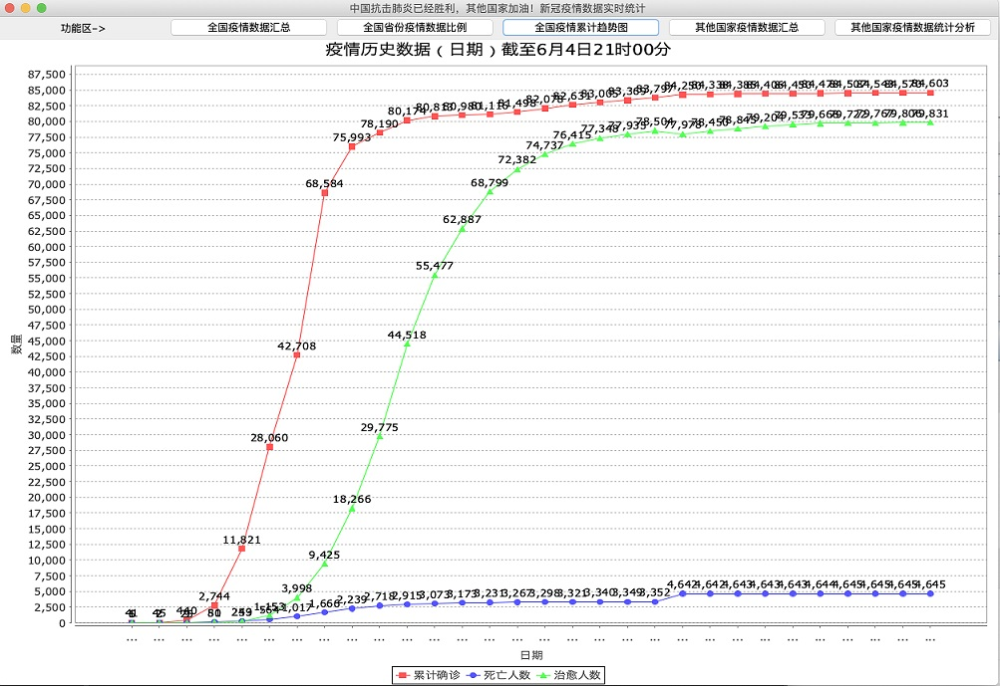
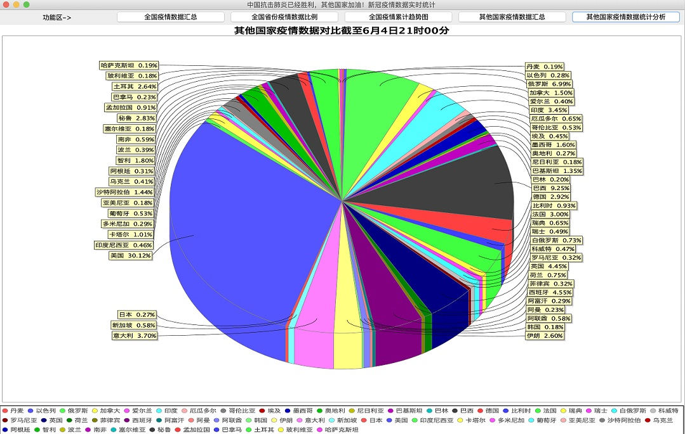

# Java-training-camp-6-15-6-19-
### 扣丁学堂 Java训练营(6月15日——6月19日)

## 课程介绍

俗话说三百六十行，行行出状元！有很多同学，对编程感兴趣，但是又不了解！希望通过本次训练营，让我们能从零到一，找到编程世界的大门！

```
为什么要学编程？
	 上学时老师讲，学好数理化走遍天下都不怕，而实际生活中那些知识并没有直接用途，但我们还是得学习，因为很多是我们的基本常识。随着互联网的发展，人与人的交流越来越开放和多元化。我们越来越发现，每天伴随着我们的成了手机，电脑，ipad，任何一个人离开这三样东西恐怕都无法忍受，甚至有时候，手机是除了另一半最能陪你熬夜的热衷者。
	 在未来，我们需要和电脑交流，和各种设备交流！
	 我们要改变未来，改变世界！！！
	 编程作为信息科学的一个基本知识与技能，是受过高等教育的现代人知识框架结构中的一个组成部分。
	 无论你之后是否以编程工作，就算作为爱好，都非常有必要学它！

```

因为考虑到参加训练营的同学，编程基础参差不齐。所以本项目以小灰同学为根本，要有一丢丢基础才好，通过这个**不太难**的小项目，希望经过一周的学习，可以激发大家的学习兴趣。让你知道什么是编程，如何编程，学会了编程，能给我们的工作、人生，又会带来怎样的影响。。。


### 一、课前准备
**【请详细阅读此项】**

网盘链接地址：链接:https://pan.baidu.com/s/1Kqg-O0r7H7KpXAXT3xvXww  密码:dqh4

1、安装JDK，搭建Java环境

> 说明：
> 		a：如果您的电脑已经安装好了jdk，并配置好环境变量。可以跳过此步骤。
> 		b：如果您的电脑尚未安装任何的jdk，请尽量使用网盘中的安装包，和老师使用版本统一。


	A：请先下载网盘中的jdk安装文件：jdk-8u77-windows-x64.exe
		建议您选择jdk的8版本。（不建议安装过高的jdk版本。）
	
	B：请根据录播视频，进行安装
	
	C：请根据录播视频，进行配置环境变量
	
	D：如果配置中发生了疑问，可以询问老师。


2、安装eclipse开发工具

> 说明：如果您有一定的编程基础，电脑中已经安装了eclipse或者IntelliJ IDEA等开发工具，可以跳过此步骤。

	A：请先下载网盘中的eclipse压缩包
	
	B：eclipse软件是免安装版，直接解压缩即可使用。
	
	C：可以参照录播视频。


3、建议安装一个文本编辑器(此操作不强制)

> 说明：建议您的电脑上安装一个文本编辑器：如VSCode、Sublime Text，Editplus，NotePad++等其中的一种即可。	

```
A：VSCodeUserSetup-x64-1.45.0.exe。(傻瓜式安装)
	网盘中，提供了VSCode的安装包。
```


4、下载网盘链接中的软件

	A：typora-setup-x64.exe
			编写和阅读MarkDown文档的软件(傻瓜式安装)
	B：YoudaoDictSetup.exe
		有道词典(尤其是英文水平较弱的同学，建议安装)(傻瓜式安装)
	
	C：typeeasy.22055.12012.0.exe
		金山打字通，如果您的打字速度一般，建议业余时间要练习打字速度。
		
	D：其他
### 二、课程大纲

| 天   | 时间        | 标题              | 内容                                                         | 备注 |
| ---- | ----------- | ----------------- | ------------------------------------------------------------ | ---- |
| Day1 | 20:00-21:30 | Java入门基础      | 1、开营典礼<br />2、项目介绍<br />3、搭建环境<br />4、面向对象 |      |
| Day2 | 20:00-21:30 | 网络请求&数据抓取 | 1、网络请求<br />2、数据抓取<br />3、方法的使用              |      |
| Day3 | 20:00-21:30 | 疫情数据图表展示  | 1、疫情数据处理                                              |      |
| Day4 | 20:00-21:30 | json解析          | 1、抓取网络数据<br />2、json解析                             |      |
| Day5 | 20:00-21:30 | 项目代码优化&总结 | 1、代码优化<br />2、总结                                     |      |


#### 

### 三、项目介绍

项目名称：《疫情数据抓取和分析》

1. 通过我们数天的集训，帮助学员自主完成《疫情数据抓取和分析》项目。
2. 掌握Java语言编程思想，学会基本的编程语法，理解什么是编程，掌握一些简单的算法逻辑，掌握网络访问，掌握json数据解析，轻松迈出Java学习的第一步！


#### 1、项目描述

这个项目，主要是通过网络接口，获取疫情的数据，然后进行json解析，整理封装后，以图表的形式展示。


#### 2、项目所需的技术要点

1、Java编程基础：变量，常量，运算符，数据类型，分支语句，循环语句等。

2、一些逻辑运算和分析

3、异常处理

4、集合的使用

5、IO操作

6、多线程处理

7、Swing组建的初步使用

8、网络访问

9、JSON解析

10、。。。。


#### 3、项目截图

项目截图一：


项目截图二：


项目截图三：


项目截图四：



项目截图五：


项目截图六：




#### 4、项目亮点

亮点一：可以通过短短几天的学习，让你体会到编程的乐趣，迈出第一步。

亮点二：融合了一些java的编程思想，数据解析等，我们共同关注国内外抗疫情况。

亮点三：学习编程知识的同时，还兼顾家国大事。

亮点四：愿世界和平。。


### 五、作业

每天都有相应的作业，请大家按时完成。